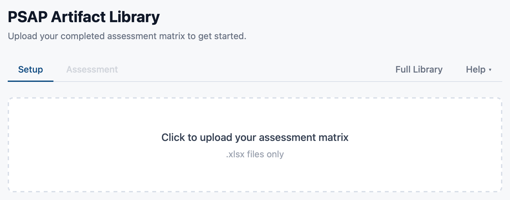
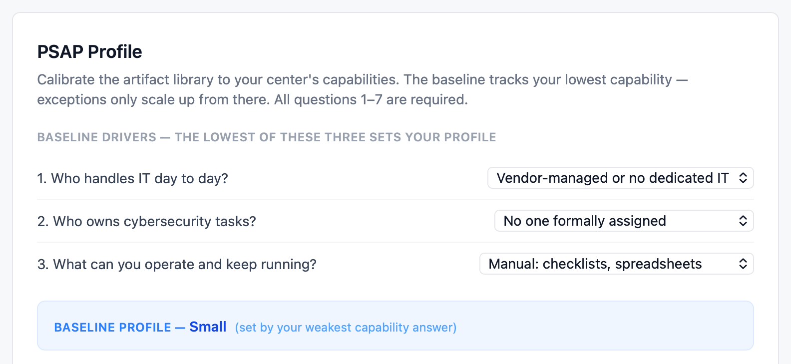
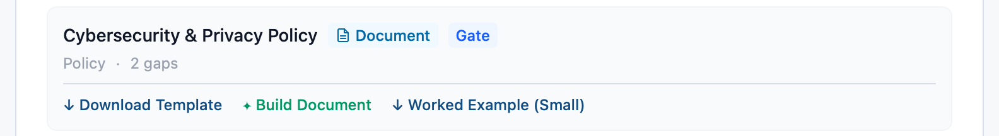
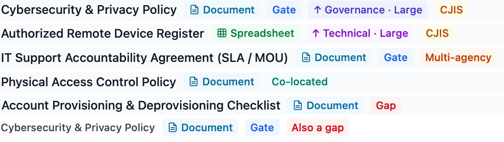

# PSAP Artifact Library: Quick Start

The Artifact Library turns your completed security assessment into a build list: the documents your center still needs, the order to build them in, and a head start on writing each one.

## Get started

1. **Upload your assessment matrix.** Use the `.xlsx` workbook from your deliverable package, exactly as you received it. It stays saved to your login.

   
2. **Complete your profile.** Answer questions 1 to 7, then press **Continue to Assessment**.

   
3. **Open Build Priority.** Settle the artifacts marked **Gate** first, then work through the rest.
4. **Build each artifact.** For a Word document, use **Build Document** or **Download Template**. For a spreadsheet, download it and complete it in Excel. If you have never written one before, open the **Worked Example** first.

   
5. **Finish, then adopt.** Complete the document in Word or Excel, then approve and adopt it through your center's usual process.

Full guide: Parts 1 to 7.

## Know this first

- **Your matrix and profile are saved. The document builder is not.** Start a document only when you can finish and download it in one sitting.
- **What is saved belongs to your login, not your center.** A colleague who uses the library starts with nothing saved: they upload the same matrix and enter the same profile answers themselves.
- **Every document needs finishing.** The builder fills repeated details such as your agency name and dates. You complete the tables and any bracketed prompts, and delete the drafting guidance before you publish.
- **Gates come first.** A gate settles a decision other documents depend on. Drafting past one usually means rewriting later.
- **If something stops working, reopen the library from Tools.** That starts a fresh session and fixes most problems.
- **The library does not track your progress.** Keep your own record of what is drafted, approved, and adopted.

Full guide: 1.3, 4.3, 6.1, 7.7.

---

# PSAP Artifact Library: Quick Reference

## The three results tabs

| Tab                | Use it to                              |
| ------------------ | -------------------------------------- |
| **Build Priority** | Work through your list, in build order |
| **By Question**    | See why an artifact is on your list    |
| **Reference**      | Check what you already have in place   |

Full guide: 4.5 to 4.7.

## What you can do with an artifact

| Action                | What it gives you                                                                           |
| --------------------- | ------------------------------------------------------------------------------------------- |
| **Build Document**    | Fill in the recurring details on the site, then download the Word file. Word documents only |
| **Download Template** | The blank file, to complete yourself                                                        |
| **Worked Example**    | A completed specimen for a center your size                                                 |

Full guide: 4.9.

## Markers

| Marker                           | Meaning                                                                                 |
| -------------------------------- | --------------------------------------------------------------------------------------- |
| **Document**                     | Word file. Build it on the site, or download the template                               |
| **Spreadsheet**                  | Excel file. Download it and complete it in Excel                                        |
| **Gate**                         | Approve and adopt this before the work that depends on it                               |
| **Gap**                          | Addresses one of your open gaps                                                         |
| **Also a gap**                   | You already have this, and it answers an open gap too. Extend it rather than start over |
| **CJIS**                         | Touches CJIS data. Stricter handling applies                                            |
| **Technical**, **Governance**    | Your profile scales this above your baseline                                            |
| **Multi-agency**, **Co-located** | Applies because of your center's structure                                              |

Full guide: 4.8.

## Ratings

- **Gaps:** No, In Progress, Planned, Unknown. These build your list.
- **Covered:** Yes, Not Applicable. These appear on the **Reference** tab.

Full guide: 2.3.

## Before you publish a document

- [ ] Tables completed
- [ ] Bracketed prompts answered or removed
- [ ] **How to use this template** box deleted
- [ ] **Drafter's note** deleted
- [ ] Guidance notes between « and » deleted
- [ ] Small, Medium, and Large guidance rows reduced to the one for your profile
- [ ] Instruction lines under **Profile Scaling Notes** and **Source Authority** deleted
- [ ] Version, dates, and named roles checked
- [ ] Classification checked. You may raise it, never lower it

Full guide: 6.10, 7.4.

## If something goes wrong

| If you see                                                | Do this                                                                                           |
| --------------------------------------------------------- | ------------------------------------------------------------------------------------------------- |
| Your session has expired, or _Unauthorized_               | Close the panel and reopen the library from **Tools**                                             |
| A sheet was not found, or only `.xlsx` files are accepted | Upload the matrix exactly as it was delivered                                                     |
| Your saved matrix is missing when you return              | Reopen from **Tools** first. If it is still missing, upload it again                              |
| Your matrix could not be saved                            | Upload it again before you leave                                                                  |
| A colleague's library is empty                            | Saved data belongs to each login. They upload the matrix and enter the profile answers themselves |
| Could not reach the server                                | Check your connection and try again                                                               |
| Temporarily unavailable                                   | Try again shortly. If it continues, contact 911 Authority                                         |

Full guide: 1.3, 2.7, 6.7.
